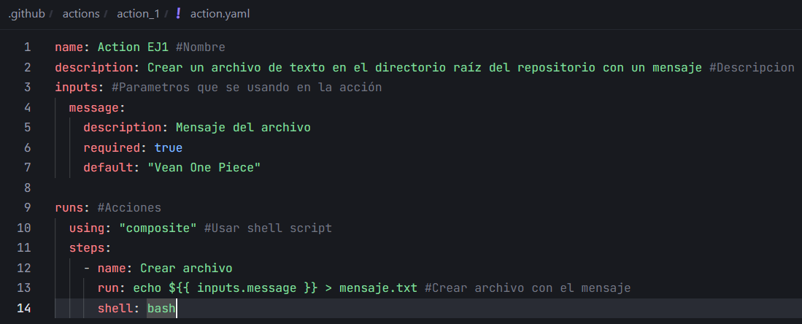
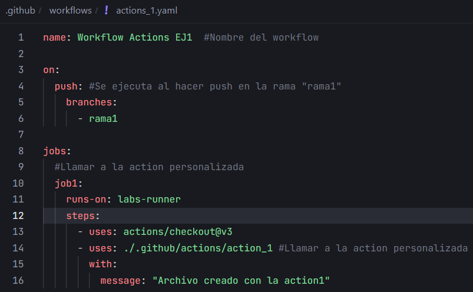
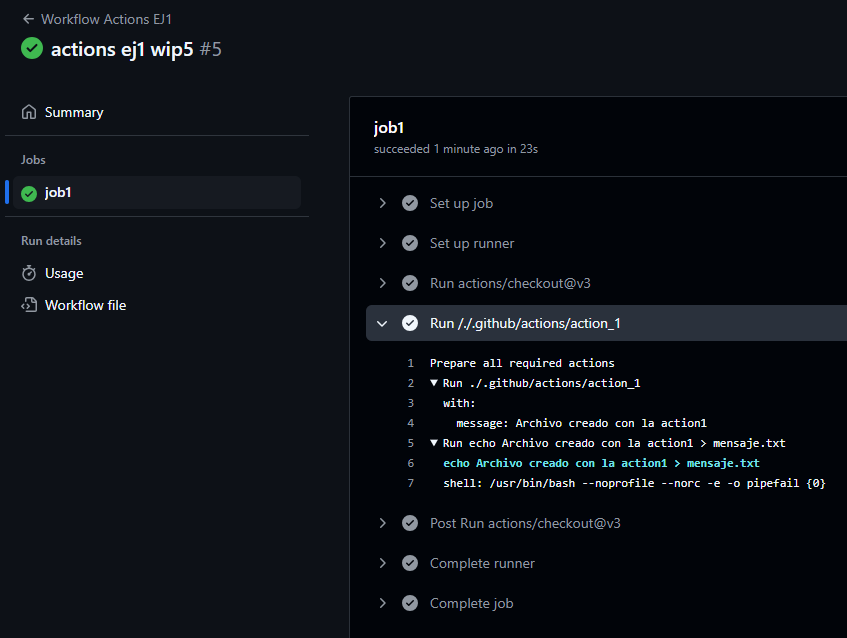

# Actions - Ejercicio 1

## Crear una action personalizada que sea capaz de crear un archivo de texto en el directorio raíz del repositorio con un mensaje

Crear action personalizada:



Crear workflow:



Primero hacemos un checkout y llamamos a la action personalizada usando ruta relativa:

```yaml
- uses: actions/checkout@v3
- uses: ./.github/actions/action_1 #Llamar a la action personalizada
```

Resultado:

