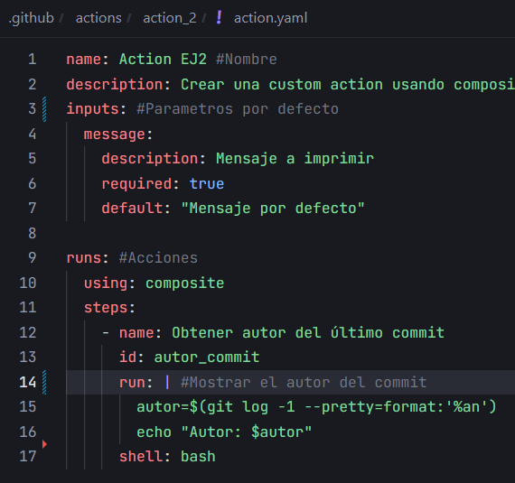
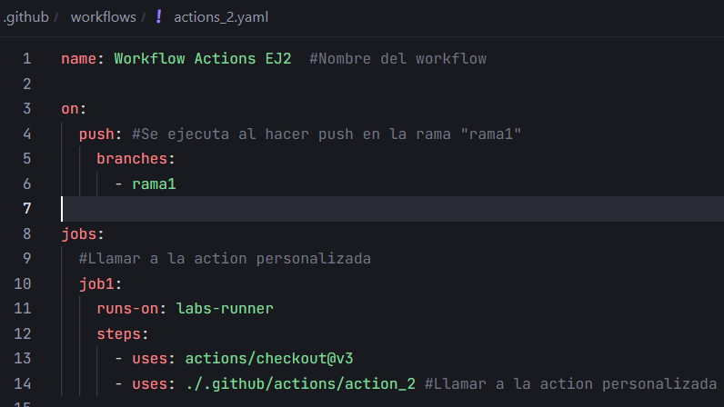
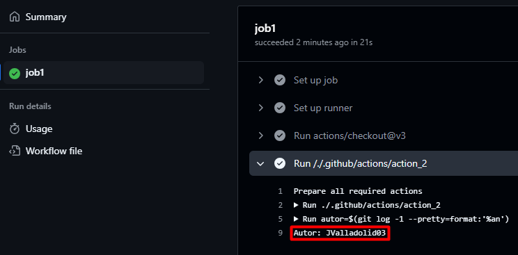

# Actions - Ejercicio 2

## Crear una custom action usando composite actions que imprime el nombre del autor del último commit en los logs del workflow

Action personalizada:



Para obtener el nombre del autor del último commit se utiliza el comando:

```bash
git log -1 --pretty=format:"%an"
```

Workflow que llama a la action:



Resultado:

