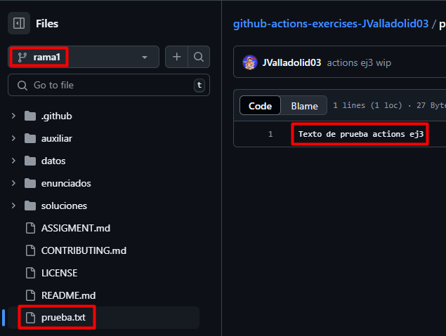
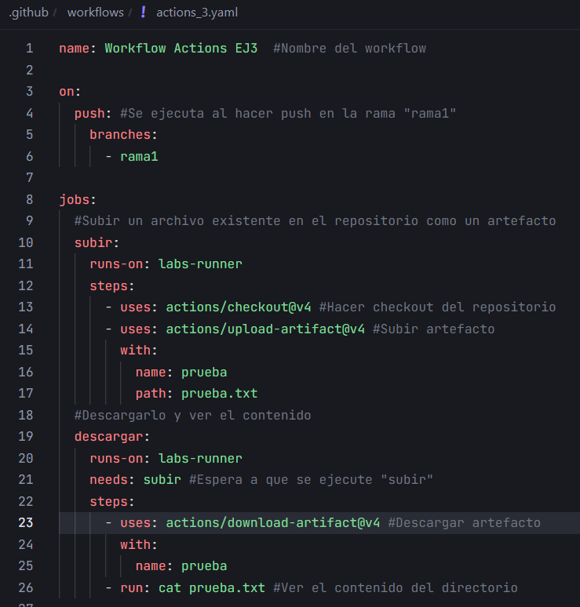
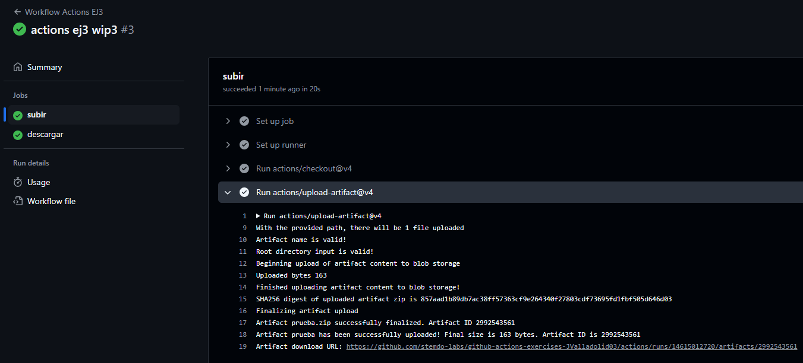
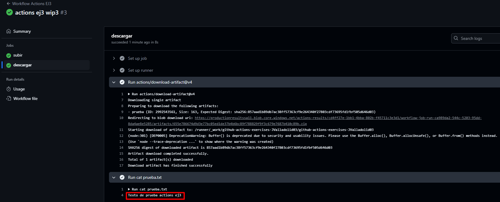

# Actions - Ejercicio 3

## Crear un workflow que suba un archivo existente en el repositorio como un artefacto, y luego lo descargue y muestre su contenido en una tarea posterior

Crear un archivo de prueba en el repositorio:



Crear el workflow:



Para subir el archivo como artefacto uso:

```yaml
- uses: actions/upload-artifact@v4 #Subir artefacto
    with:
        name: prueba
        path: prueba.txt
```

Y para descargarlo uso:

```yaml
- uses: actions/download-artifact@v4 #Descargar artefacto
    with:
        name: prueba
```

Resultado:



