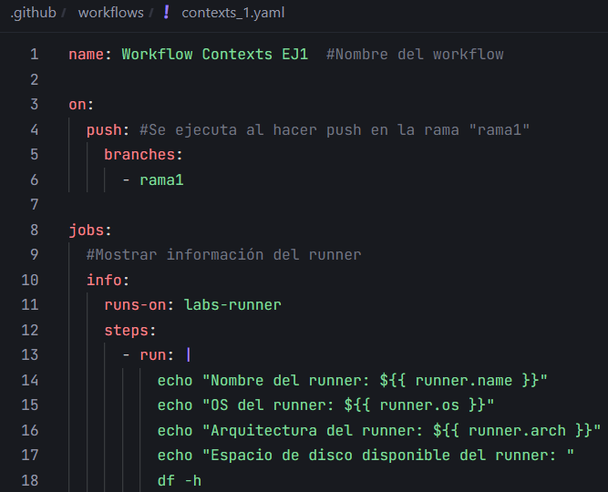
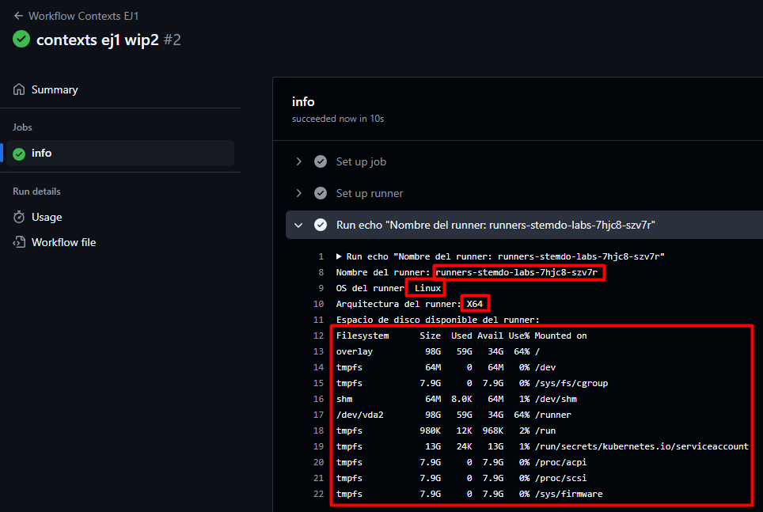

# Contexts - Ejercicio 1

## Configura un workflow que imprima información sobre el runner en el que se está ejecutando el job, como el nombre del sistema operativo, la arquitectura, y el espacio en disco disponible

Workflow:

Los parámetros del context para ver la información del runner son:

- runner.name = Ver el nombre
- runner.os = Ver el sistema operativo
- runner.arch = Ver la arquitectura

Por último uso el comando `df -h` para ver el espacio en disco disponible.

Resultado:

