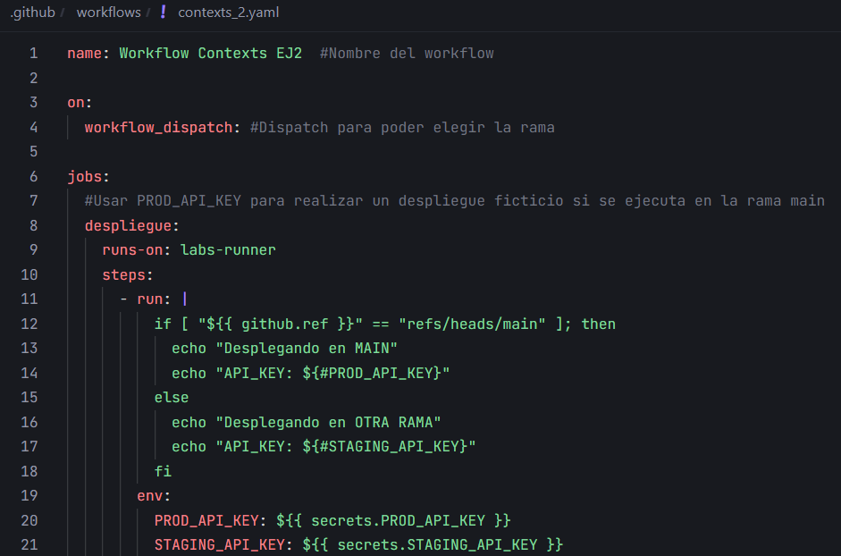
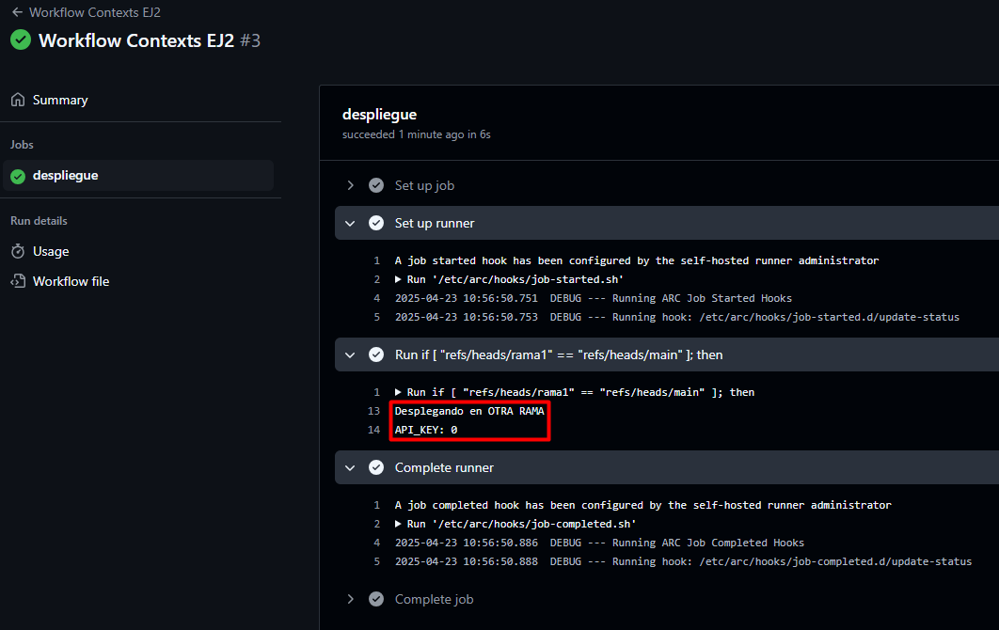

# Contexts - Ejercicio 2

## Configura un workflow que utilice un secreto llamado PROD_API_KEY para realizar un despliegue ficticio si se ejecuta en la rama main, y otro secreto llamado STAGING_API_KEY para cualquier otra rama

Workflow:



**El workflow debería:**

- Utilizar el contexto secrets para inyectar la API Key correspondiente en un comando de despliegue ficticio.

Controlar la rama en la que se ejecuta:

```yaml
if [ "${{ github.ref }}" == "refs/heads/main" ]; then
```

En caso de que se haga en main el despliegue ficticio se hace con:

```yaml
 ${{ secrets.PROD_API_KEY }}
```

En caso de que se haga en otra rama el despliegue ficticio se hace con:

```yaml
${{ secrets.STAGING_API_KEY }}
```

- Imprimir un mensaje indicando cuál API Key se utilizó.

Los secrets se crean en un `env` y el mensaje se imprime con un `echo`:

```yaml
echo "API_KEY: ${#PROD_API_KEY}"
echo "API_KEY: ${#STAGING_API_KEY}"
```

Comprobar resultado ejecutando la rama main:


Comprobar resultado ejecutando otra rama:


