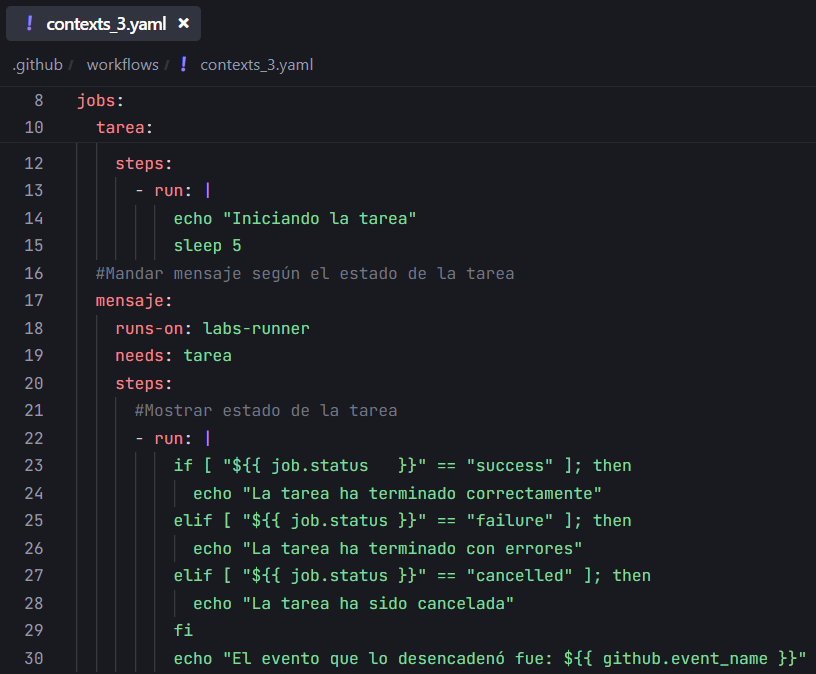
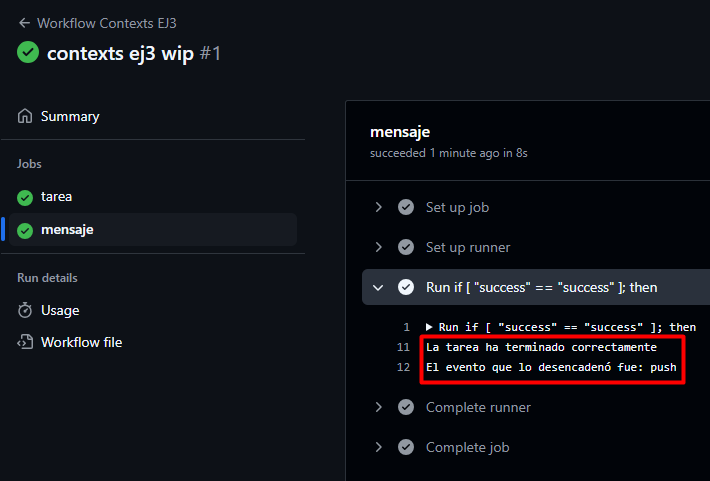

# Contexts - Ejercicio 3

## Configura un workflow que realice una tarea ficticia y luego envíe un mensaje de notificación a una URL (simulada con echo) usando el estado del job y el nombre del evento que lo desencadenó

Workflow:

Para la tarea ficticia uso un `sleep 5` y para comprobar el estado del job uso un if comparando el `job.status` con los 3 valores posibles `success`, `failure` y `cancelled`.

Resultado:

