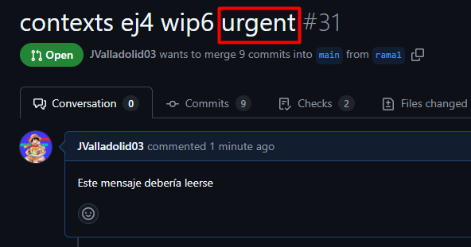
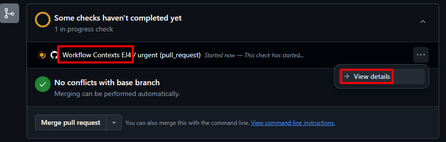
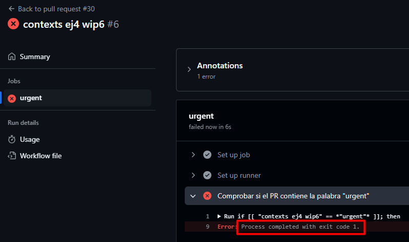

# Contexts - Ejercicio 4

## Configura un workflow que se ejecute cuando se abra una pull_request. El workflow debería verificar si el título del pull request contiene una palabra clave específica (urgent). Si la palabra se encuentra en el título, imprime el título y cuerpo de la PR, si la palabra no se encuentra en el título, haz que la ejecución falle.

Workflow:


Para comprobar el nombre de el PR uso:

```yaml
if [[ "${{ github.event.pull_request.title }}" == *"urgent"* ]]; then
```

Y si contiene la palabra, muestro el título y el cuerpo con:

```yaml
echo "Titulo: ${{ github.event.pull_request.title }}"
echo "Cuerpo: ${{ github.event.pull_request.body }}"
```

Si no, hago que falle con `exit 1`

Comprobación teniendo la palabra clave:






Comprobación sin la palabra clave:


