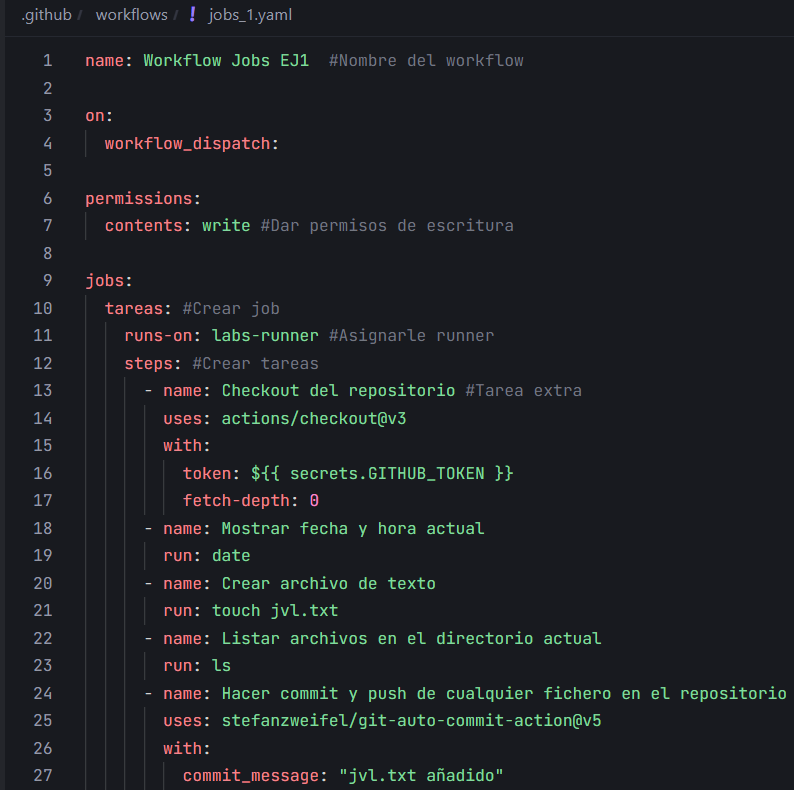
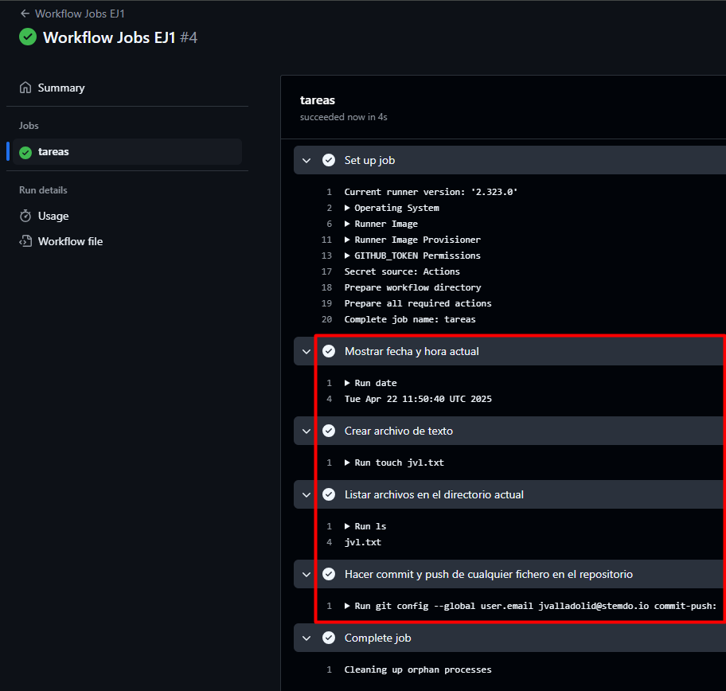

# Jobs y Steps - Ejercicio 1

## Configura un workflow (workflow_dispatch) con un solo job que haga las siguientes tareas:

Workflow:



- Mostrar la fecha y hora actual.

```yaml
- name: Mostrar fecha y hora actual
  run: date
```

- Crear un archivo de texto.

```yaml
- name: Crear archivo de texto
  run: touch jvl.txt
```
- Listar los archivos en el directorio actual.

```yaml
- name: Listar archivos en el directorio actual
  run: ls
```
- Hacer un commit y push de cualquier fichero en el repositorio.

```yaml
- name: Hacer commit y push de cualquier fichero en el repositorio
  run: |
    git config --global user.name "JValladolid03"
    git config --global user.email jvalladolid@stemdo.io
    git add .
    git commit -m "Commit desde GitHub Actions" || echo "Error al subir"
    git push
```

Resultado:

