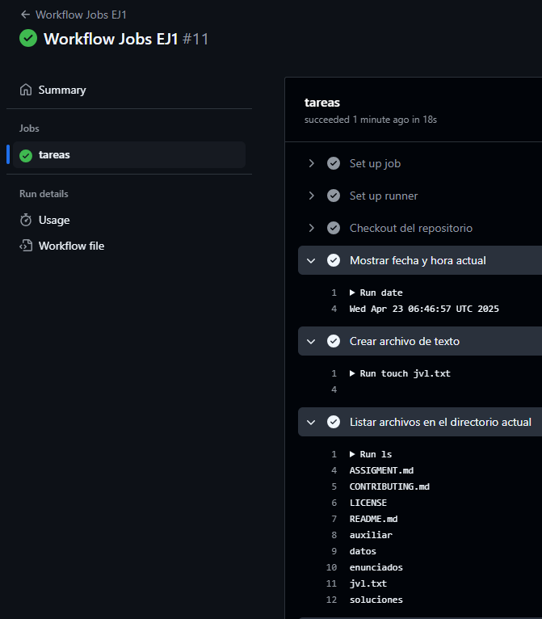

# Jobs y Steps - Ejercicio 1

## Configura un workflow (workflow_dispatch) con un solo job que haga las siguientes tareas:

Workflow:


- Mostrar la fecha y hora actual.

```yaml
- name: Mostrar fecha y hora actual
  run: date
```

- Crear un archivo de texto.

```yaml
- name: Crear archivo de texto
  run: touch jvl.txt
```
- Listar los archivos en el directorio actual.

```yaml
- name: Listar archivos en el directorio actual
  run: ls
```
- Hacer un commit y push de cualquier fichero en el repositorio.

```yaml
- name: Hacer commit y push de cualquier fichero en el repositorio
  uses: stefanzweifel/git-auto-commit-action@v5
  with:
    commit_message: "jvl.txt añadido"
```

Para poder hacer los cambios en el repositorio primero tenemos que hacerle un checkout con el token de acceso:

```yaml
- name: Checkout del repositorio #Tarea extra
  uses: actions/checkout@v3
  with:
    token: ${{ secrets.GITHUB_TOKEN }}
    fetch-depth: 0
```

Resultado:




