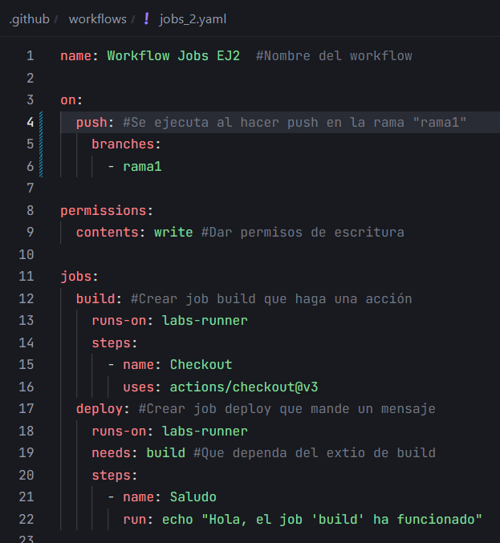

# Jobs y Steps - Ejercicio 2

## 1. Configura dos jobs en un único workflow: "build" y "deploy"

Workflow:



- En el job deploy imprime un mensaje por la consola.

```yaml
steps:
    - name: Saludo
    run: echo "Hola, el job 'build' ha funcionado"
```

- El job deploy debe depender del éxito del job build.

```yaml
needs: build #Que dependa del extio de build
```

- Si el job "build" falla, el job "deploy" **no debe ejecutarse.**

Comprobación de que no sale el mensaje si el job `build` falla:

