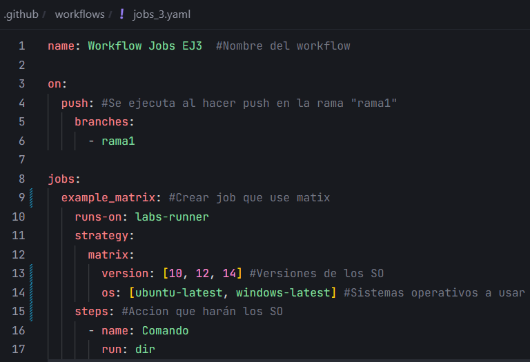
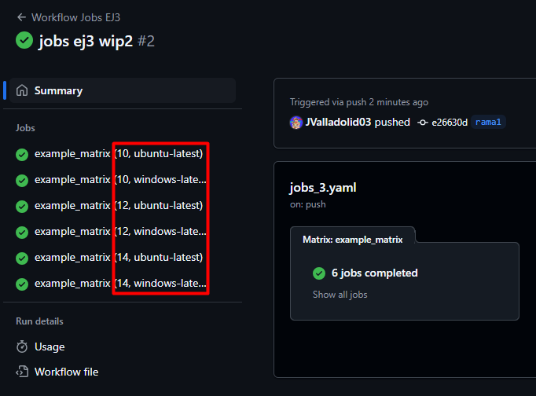

# Jobs y Steps - Ejercicio 3

## Configura un workflow que ejecute el mismo job en diferentes sistemas operativos

Workflow:



Para poder ejecutar el mismo job en diferenetes SO usamos `matrix`:

```yaml
strategy:
    matrix:
        version: [10, 12, 14] #Versiones de los SO
        os: [ubuntu-latest, windows-latest] #Sistemas operativos a usar
```

Comprobar que funciona:

