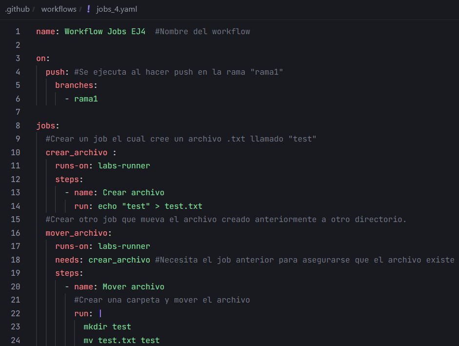
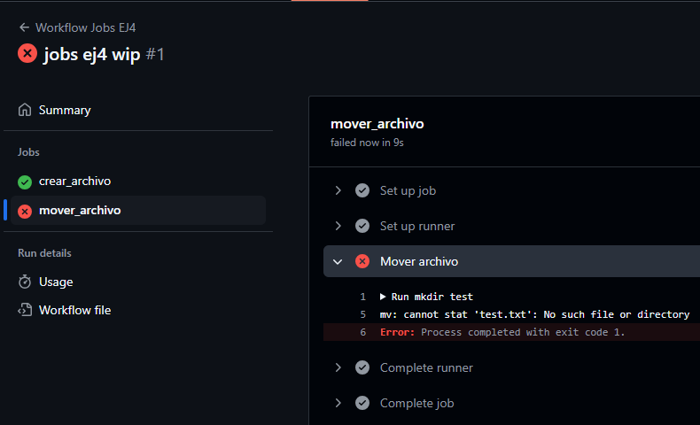

# Jobs - Ejercicio 4

Workflow:



## 1. Crea un job el cual cree un archivo .txt llamado "test"

```yaml
#Crear un job el cual cree un archivo .txt llamado "test"
  crear_archivo :
    runs-on: labs-runner
    steps:
      - name: Crear archivo
        run: echo "test" > test.txt
```

## 2. Crea otro job que mueva el archivo creado anteriormente a otro directorio.

```yaml
#Crear otro job que mueva el archivo creado anteriormente a otro directorio.
  mover_archivo:
    runs-on: labs-runner
    needs: crear_archivo #Necesita el job anterior para asegurarse que el archivo existe
    steps:
      - name: Mover archivo
        #Crear una carpeta y mover el archivo
        run: |
          mkdir test
          mv test.txt test
```

### ¿Qué ocurre?



El workflow ha dado error de que el archivo creado no exite.

Esto ocurre porque cada job de un workflow se ejecuta en entornos separados, por eso el archivo creado en el primer job es invisible para el segundo.