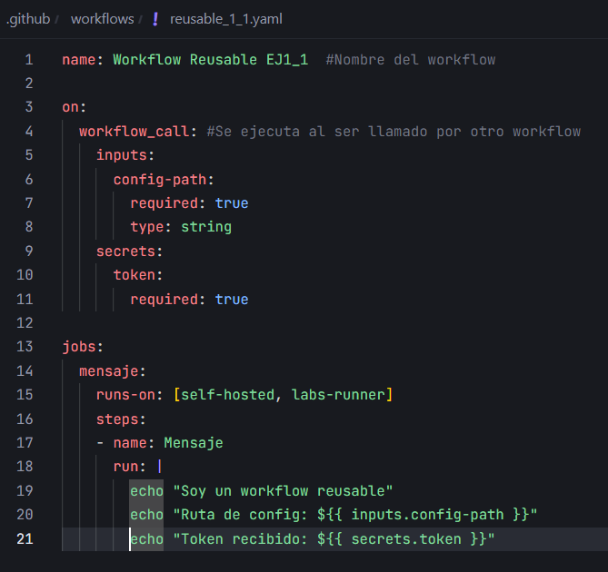
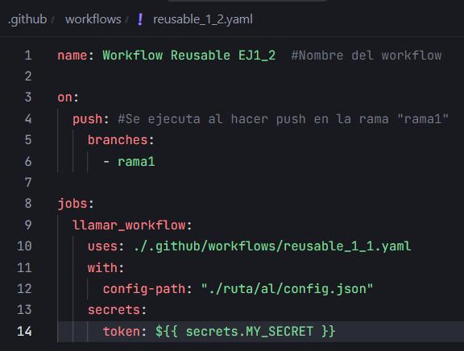
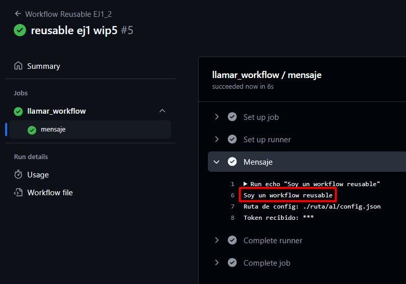

# Workflows reusables - Ejercicio 1

## Configura un workflow reutilizable que simplemente imprima un mensaje

Workflow reutilizable:

## Luego, crea otro workflow que use ese workflow reutilizable

Workflow secundario:

Resultado:

