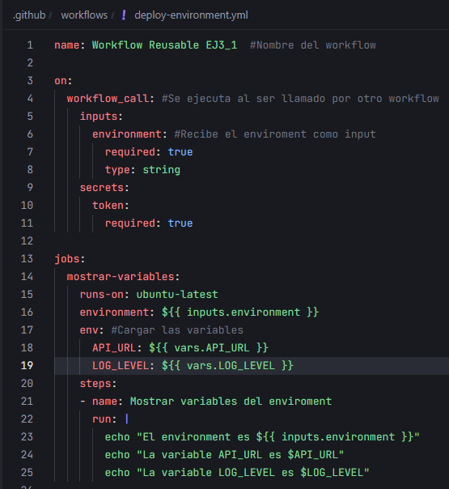
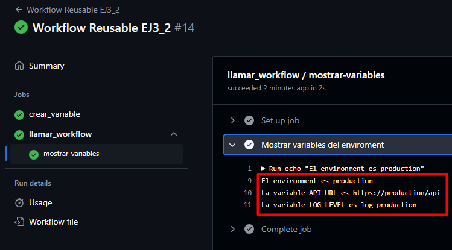

# Workflows reusables - Ejercicio 3

## En este ejercicio, configurarás un workflow reutilizable (deploy-environment.yml) que realizará tareas de despliegue basadas en un entorno específico.

## Este workflow reutilizable será llamado por otro workflow (trigger-deploy.yml) que se ejecutará automáticamente en función de la rama en la que se realice el push o mediante ejecución manual.

Cada entorno (development, staging, production) tendrá configuradas sus propias variables de entorno y secretos en GitHub, los cuales serán utilizados automáticamente por el workflow correspondiente.

Para este ejercicio se utilizarán dos repositorios, uno público, y el repositorio privado en el que se ha estado trabajando.

## Paso a paso:

> 1. Configuración de Environments en GitHub:
>
> - En el repositorio público, ve a Settings > Environments.
> - Crea tres environments: development, staging, y production.
> - Configura variables de entorno específicas para cada environment, como:
>   - API_URL
>   - LOG_LEVEL
> Estas variables de entorno tendrán valores diferentes dependiendo del environment seleccionado.

[Administración de entornos en GitHub](https://docs.github.com/es/actions/managing-workflow-runs-and-deployments/managing-deployments/managing-environments-for-deployment)

> 2. Definir el Workflow Reutilizable:
>
> Crea un archivo llamado deploy-environment.yml en el directorio .github/workflows/.
> Este workflow reutilizable recibirá un input llamado environment, el cual determinará el environment de despliegue.

> 3. Definir el Workflow que Invoca al Reusable:
>
> Crea un archivo llamado trigger-deploy.yml en el directorio .github/workflows/.
> Este workflow se activará en función de las ramas (main, develop, release/*) y llamará al workflow reutilizable para desplegar en el entorno correspondiente.

Cambiar repositorio a público:

Environment development:

Environment staging:

Environment production:

Vista general:

Crear workflow principal:

NOTA: En vez de utilizar una rama llamada "release/*" he usado la rama que ya tenía creada llamada "rama1".

Crear workflow reusable:

Comprobar con la rama main:

Comprobar con la rama rama1:

Comprobar con la rama develop:

