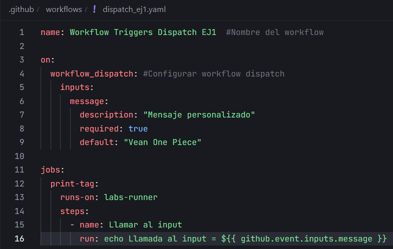
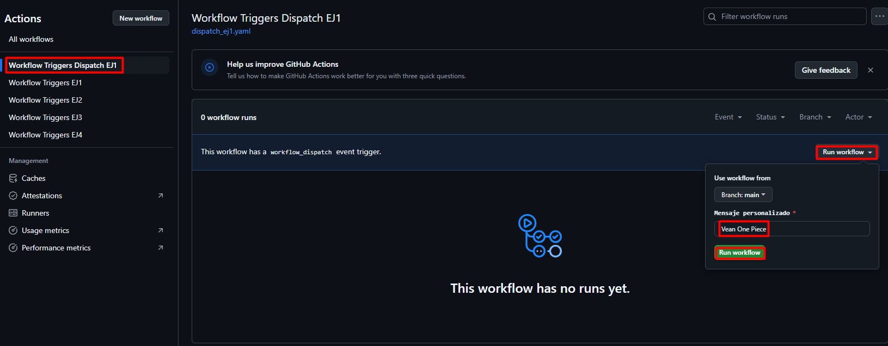
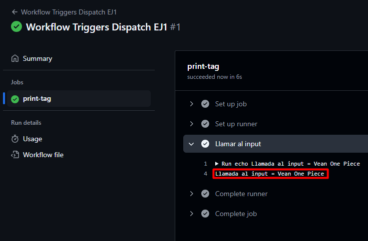

# Triggers (Dispatch) - Ejercicio 

## 1. Configura un workflow para que se ejecute manualmente usando el evento workflow_dispatch.

Crear el workflow:



Para ponerlo el modo `dispotch` se usa:

```yaml
on:
  workflow_dispatch:
```

## 2. Define un input llamado _"message"_ que permita al usuario ingresar un mensaje personalizado.

Definir el input llamado "message":

```yaml
inputs:
    message:
        description: "Mensaje personalizado"
        required: true
        default: "Vean One Piece"
```

## 3. El workflow debe ser capaz de imprimir ese mensaje.

Para imprimir el mensaje llamamos al input desde el job:

```yaml
jobs:
  print-tag:
    runs-on: labs-runner
    steps:
      - name: Llamar al input
        run: echo Llamada al input = ${{ github.event.inputs.message }}
```

Comprobar que funciona:



