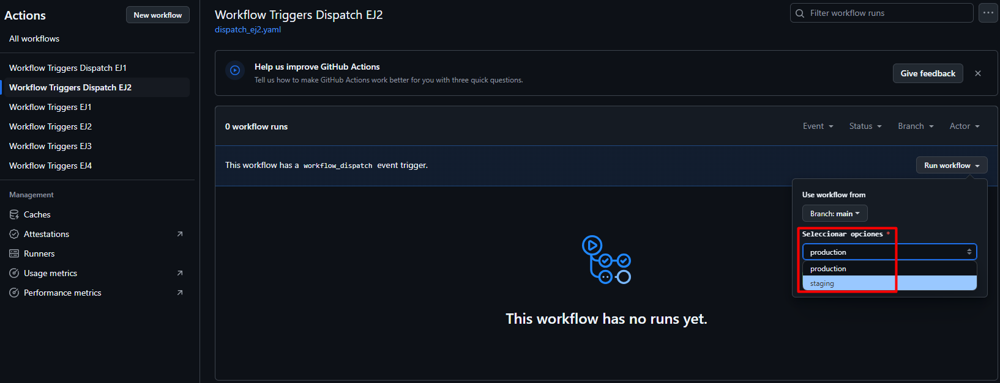

# Triggers (Dispatch) - Ejercicio 2

## 1. Configura un workflow para que se ejecute manualmente usando el evento workflow_dispatch.

Workflow:


## 2. Define un input llamado "_environment_" que permita seleccionar entre "_production_" y "_staging_".

Llamo al input `environment` y le doy el tipo `choice` para poder elegir entre las dos opciones:

```yaml
inputs:
    environment:
        description: "Seleccionar opciones"
        type: choice
        required: true
        options:
            - production
            - staging
```

## 3. Imprime el entorno seleccionado en la consola.

Se llama al al input con el job:

```yaml
jobs:
  print-tag:
    runs-on: labs-runner
    steps:
      - name: Llamar al input
        run: echo El entorno seleccionado es = ${{ github.event.inputs.environment }}
```

Comprobar que funciona:



