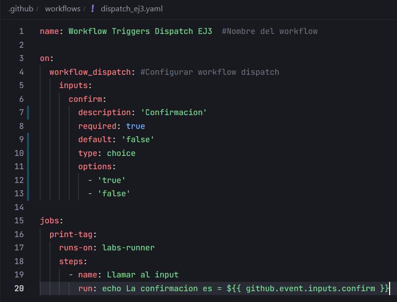
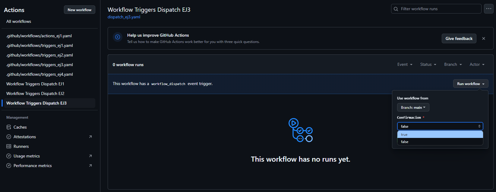

# Triggers (Dispatch) - Ejercicio 2

## 1. Configura un workflow para que se ejecute manualmente usando el evento workflow_dispatch.

Crear el workflow:



## 2. Define un input llamado _"confirm"_ que requiera una _confirmación_ ("true" o "false").

Creo el input llamado `confirm` con elección entre true y false:

```yaml
inputs:
    confirm:
        description: 'Confirmacion'
        required: true
        default: 'false'
        type: choice
        options:
            - 'true'
            - 'false'
```

## 3. Imprime un mensaje, dependiendo de si la confirmación es positiva o negativa.

Imprimir el mensaje:

```yaml
jobs:
  print-tag:
    runs-on: labs-runner
    steps:
      - name: Llamar al input
        run: echo La confirmacion es = ${{ github.event.inputs.confirm }}
```

Comprobar si funciona:



