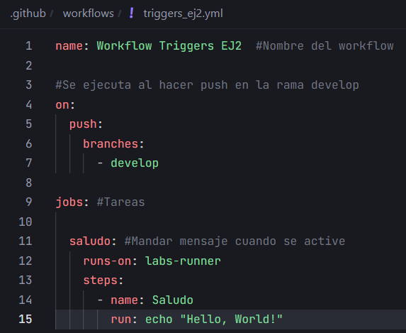
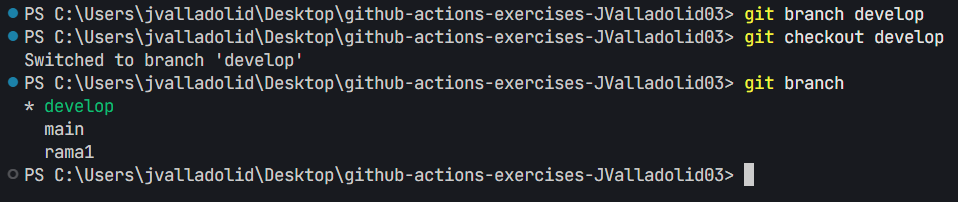
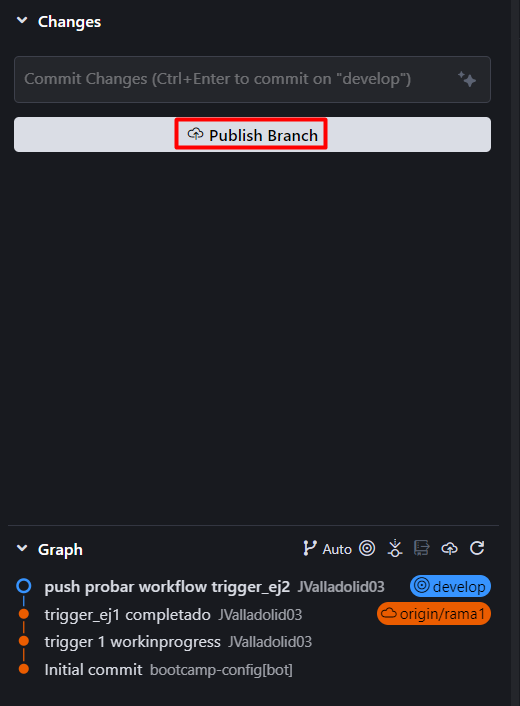
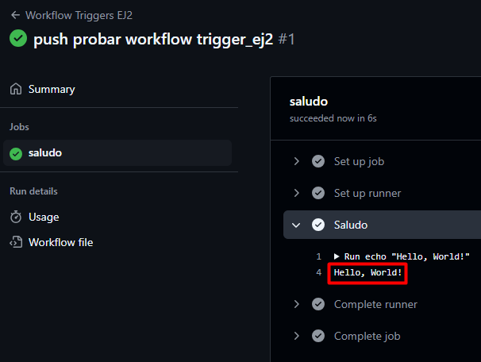

# Triggers - Ejercicio 2

## Configura un workflow para que se ejecute cuando se haga un push en la rama develop y simplemente imprima "Hello, World!" en la consola

Crear el workflow, ponermos que se active al hacer un push en la rama `develop` con:

```yaml
on:
  push:
    branches:
      - develop
```

Y que imprimar "Hello, World!" en la consola con:

```yaml
steps:
    - name: Saludo
      run: echo "Hello, World!"
```



Crear la rama `develop` con:

```bash
git branch develop
```



Hacer un push en la rama `develop`:



Comprobar que funciona:

