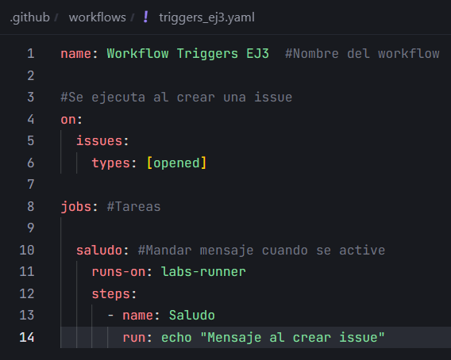
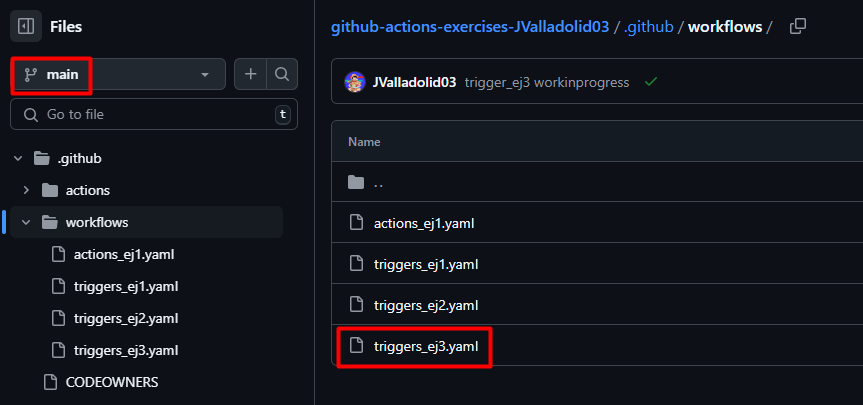
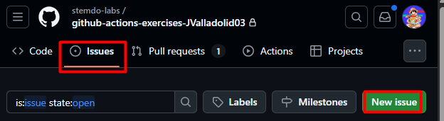
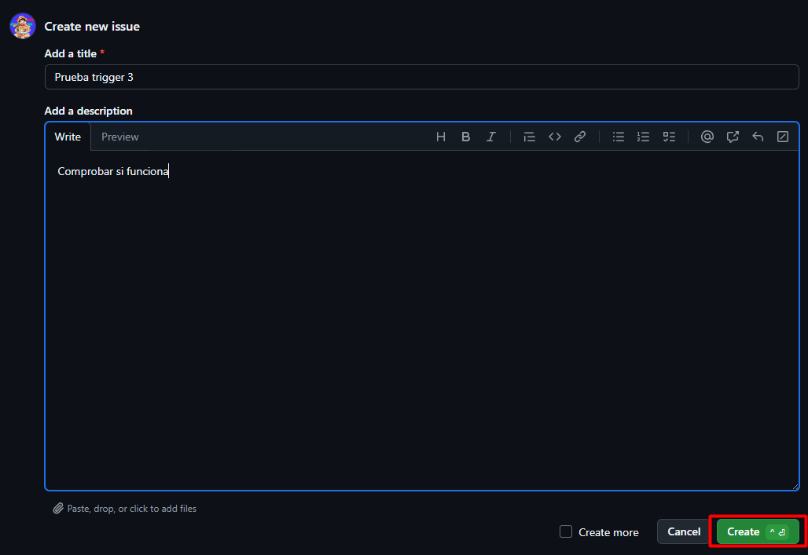
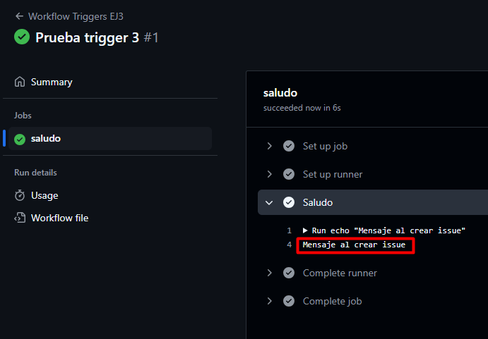

# Triggers - Ejercicio 3

## Configura un workflow para que se ejecute cuando se cree una nueva Issue

Crear el workflow:



El trigger para cuando se cree una nueva issue es:

```yaml
on:
  issues:
    types: [opened]
```

Subir el workflow a la rama main:



Crear la issue:





Comprobar que funcina:

