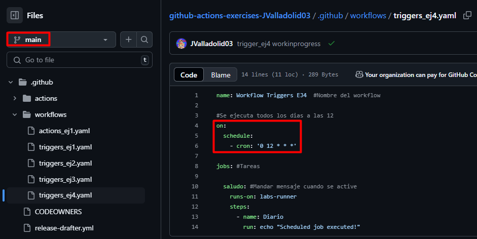

# Triggers - Ejercicio 4

## Configura un workflow para que se ejecute todos los días a las 12:00 UTC y que imprima "Scheduled job executed!" en la consola

Crear el workflow y subirlo a la rama main. Para que es ejecute a las 12 configuramos el trigger de la siguiente manera:

```yaml
on:
  schedule:
    - cron: '0 12 * * *'
```



En la sintaxis de `cron` los asteriscos representan un valor horario:

- Minutos (0-59)
- Horas (0-23)
- Día del mes (1-31)
- Mes (1-12)
- Día de la semana (0-6)

