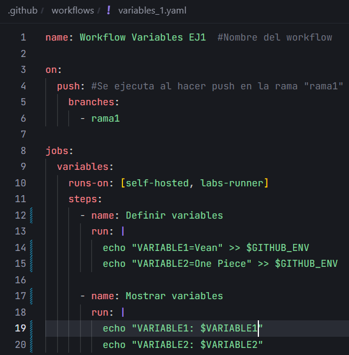

# Variables y Outputs - Ejercicio 1

## Configura un workflow con un solo job que haga las siguientes tareas

Workflow:



- En el primer step, define dos variables de entorno.

```yaml
- name: Definir variables
    run: |
        echo "VARIABLE1=Vean" >> $GITHUB_ENV
        echo "VARIABLE2=One Piece" >> $GITHUB_ENV
```

- En el segundo step, usa estas variables para ejecutar un comando o script.

```yaml
- name: Mostrar variables
    run: |
        echo "VARIABLE1: $VARIABLE1"
        echo "VARIABLE2: $VARIABLE2"
```

Resultado:

