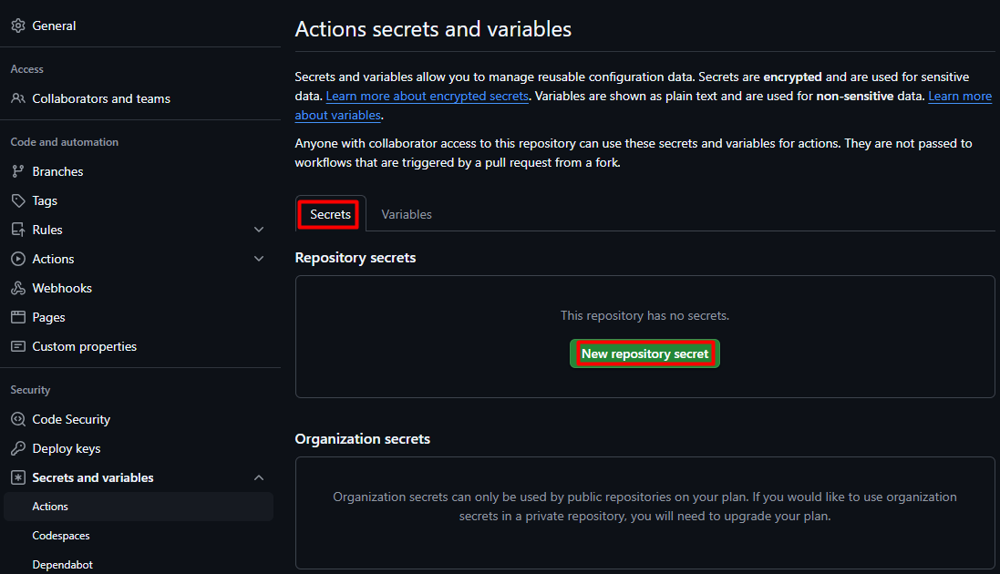
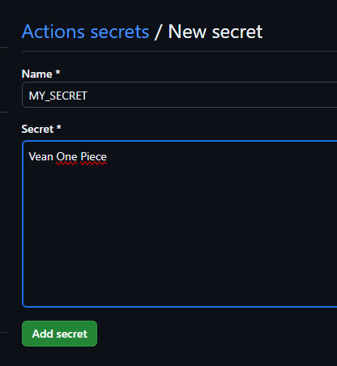
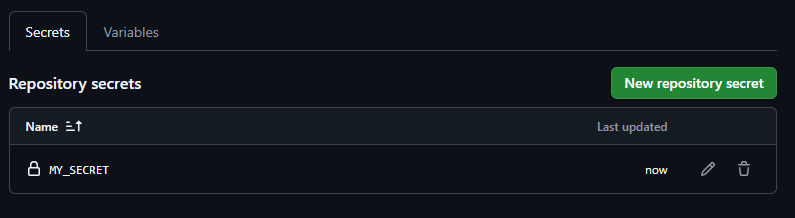
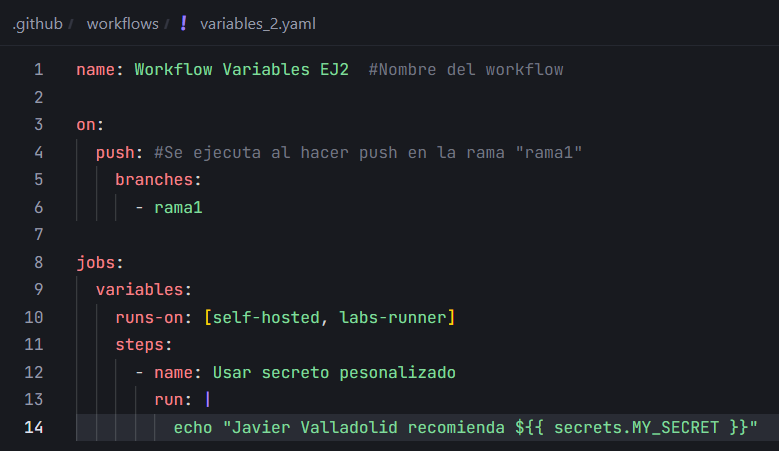
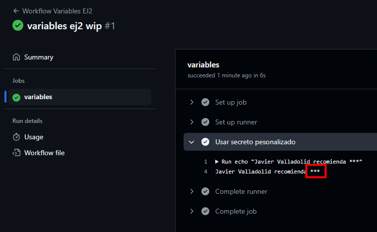

# Variables y Outputs - Ejercicio 2

## Configura un job que use un secreto definido en el repositorio (por ejemplo, MY_SECRET) y lo use en un comando.

Crear un secreto:







Workflow:



Para llamar al secreto uso:

```yaml
${{ secrets.MY_SECRET }}
```

Resultado:

