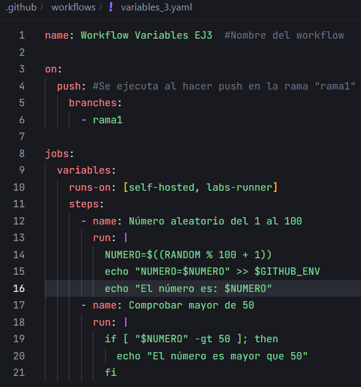
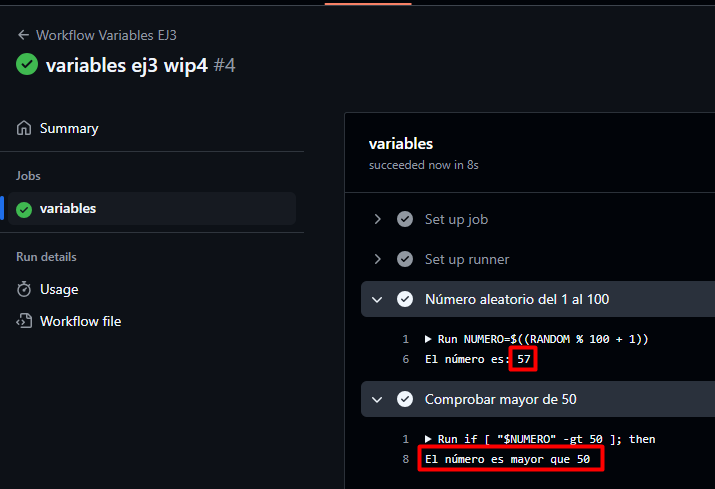
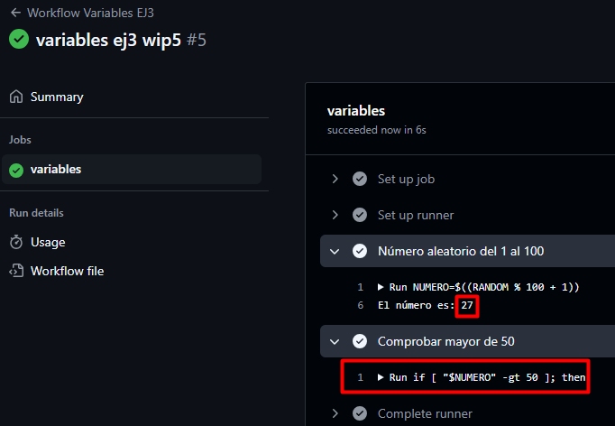

# Variables y Outputs - Ejercicio 3

## Configura un workflow siguiendo estos pasos:

Workflow:



- Define un step que genere un número aleatorio del 1 al 100.

```yaml
- name: Número aleatorio del 1 al 100
    run: |
        NUMERO=$((RANDOM % 100 + 1))
        echo "NUMERO=$NUMERO" >> $GITHUB_ENV
        echo "El número es: $NUMERO"
```

- En el segundo step, utiliza un condicional para ejecutar comandos solo si el número es mayor a 50.

```yaml
- name: Comprobar mayor de 50
    run: |
        if [ "$NUMERO" -gt 50 ]; then
        echo "El número es mayor que 50"
        fi
```

Resultado:



