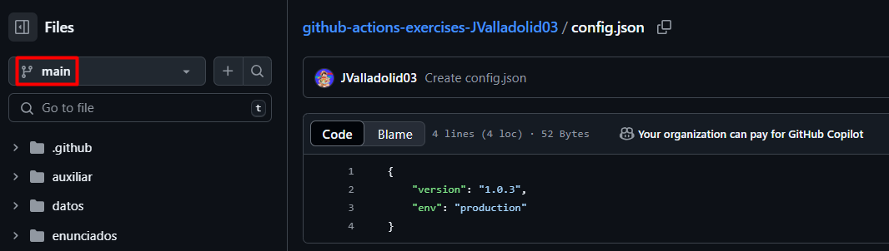
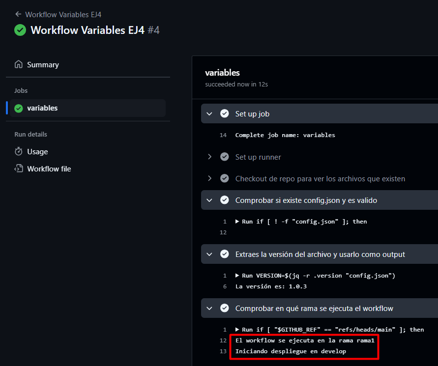

# Variables y Outputs - Ejercicio 4

## Configura un workflow que valide un archivo de configuración (config.json) y realice un despliegue condicional a develop o producción basado en la rama desde la cual se hace el push.

Crear un archivo config.json en la rama main y rama1:




Crear workflow:


### Pasos:

- Verificar que el archivo config.json exista y que tenga el formato JSON válido.

```yaml
#Paso 1
- name: Checkout de repo para ver los archivos que existen
uses: actions/checkout@v3
- name: Comprobar si existe config.json y es valido
run: |
    if [ ! -f "config.json" ]; then
    echo "El archivo config.json no existe"
    exit 1
    fi

    if ! jq -e . "config.json" > /dev/null 2>&1; then
    echo "El archivo config.json no es valido"
    exit 1
    fi
```

Primero hago un `checkout` del repo para ver los archivos, luego compruebo que existe el archivo con `if [ ! -f "config.json" ]; then` y comprueba que es válido con `if ! jq -e . "config.json" > /dev/null 2>&1; then`.

- Extraer un valor específico del archivo config.json (por ejemplo, la versión de la aplicación) y utilizarlo como un output.

```yaml
#Paso 2
- name: Extraes la versión del archivo y usarlo como output
run: |
    VERSION=$(jq -r .version "config.json")
    echo "VERSION=$VERSION" >> $GITHUB_ENV
    echo "La versión es: $VERSION"
```

- Si el push se hace en la rama main, el workflow debería simular un despliegue de la aplicación en producción.

```yaml
if [ "$GITHUB_REF" == "refs/heads/main" ]; then
    echo "El workflow se ejecuta en la rama main"
    echo "Iniciando despliegue en producción"
```

- Si el push se hace en una rama develop, el workflow debería simular un despliegue de la aplicación en develop.

```yaml
elif [ "$GITHUB_REF" == "refs/heads/rama1" ]; then
    echo "El workflow se ejecuta en la rama rama1"
    echo "Iniciando despliegue en develop"
fi
```

- Si el archivo config.json no es válido, el workflow debería fallar y detenerse sin realizar el despliegue.

Este paso lo cumplo añadiendo un `exit 1` al final de cada if del paso 1.

Resultado:


