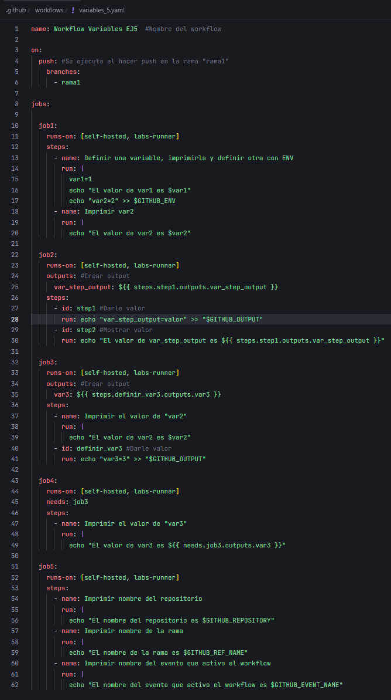
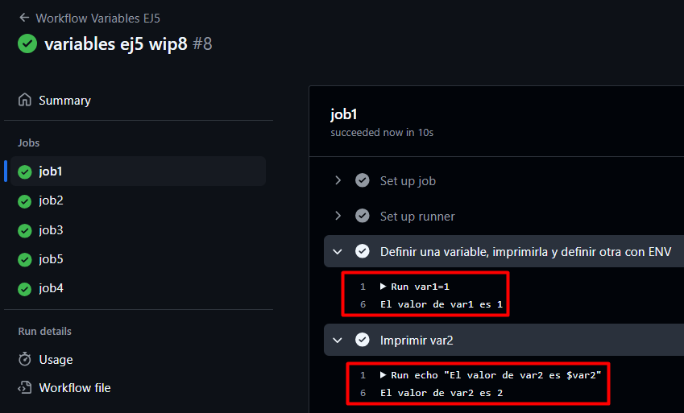

# Ejercicio 5

Workflow:



Variables entre pasos de un mismo job:

- Crea un job que:
  - Defina una variable local ``var1`` con valor 1 y la imprima.
  - Defina una variable ``var2`` usando el entorno de GitHub (``$GITHUB_ENV``) con valor 2.
  - Imprima el valor de ``var2`` en un paso diferente.

```yaml
job1:
  runs-on: [self-hosted, labs-runner]
  steps:
    - name: Definir una variable, imprimirla y definir otra con ENV
      run: |
        var1=1
        echo "El valor de var1 es $var1"
        echo "var2=2" >> $GITHUB_ENV
    - name: Imprimir var2
      run: |
        echo "El valor de var2 es $var2"
```

Resultado:



---
Compartir variables entre pasos usando outputs:

- Crea un job que:
  - Defina un output ``var_step_output`` con valor "valor".
  - Imprima el valor de ``var_step_output`` en un paso posterior.

```yaml

```


---
Compartir variables entre jobs:

- Crea un job que:
  - Imprima el valor de ``var2`` y observa qué sucede.
  - Defina un output ``var3`` con valor 3 para compartir con otros jobs.

---
Imprimir variables entre jobs:

- Crea un job que dependa del anterior y:
  - Imprima el valor de ``var3`` definido en el job anterior.

---
Usar variables predefinidas de GitHub:

- Crea un job que imprima las siguientes variables predefinidas por GitHub:
  - Nombre del ``repositorio``.
  - Nombre de la ``rama``.
  - Nombre del ``evento`` que activó el workflow.
