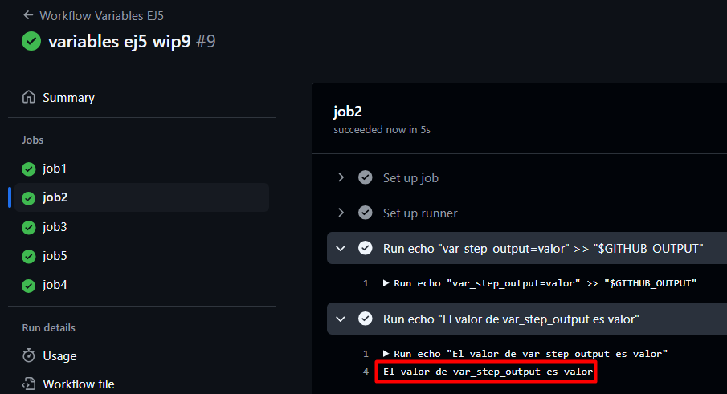
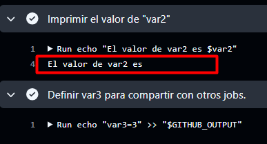
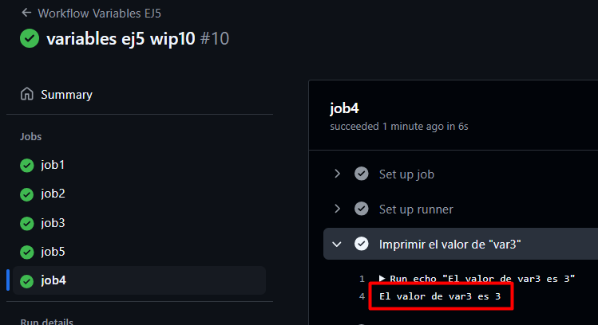
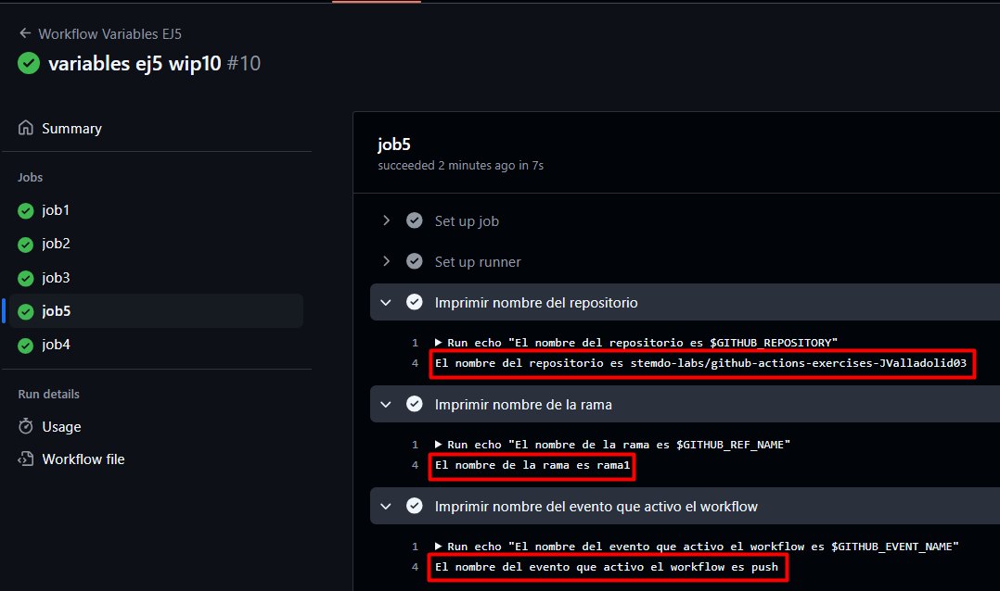

# Ejercicio 5

Workflow:


Variables entre pasos de un mismo job:

- Crea un job que:
  - Defina una variable local ``var1`` con valor 1 y la imprima.
  - Defina una variable ``var2`` usando el entorno de GitHub (``$GITHUB_ENV``) con valor 2.
  - Imprima el valor de ``var2`` en un paso diferente.

```yaml
job1:
  runs-on: [self-hosted, labs-runner]
  steps:
    - name: Definir una variable, imprimirla y definir otra con ENV
      run: |
        var1=1
        echo "El valor de var1 es $var1"
        echo "var2=2" >> $GITHUB_ENV
    - name: Imprimir var2
      run: |
        echo "El valor de var2 es $var2"
```

Resultado:


---
Compartir variables entre pasos usando outputs:

- Crea un job que:
  - Defina un output ``var_step_output`` con valor "valor".
  - Imprima el valor de ``var_step_output`` en un paso posterior.

```yaml
job2:
  runs-on: [self-hosted, labs-runner]
  outputs: #Crear output
    var_step_output: ${{ steps.step1.outputs.var_step_output }}
  steps:
    - id: step1 #Darle valor
      run: echo "var_step_output=valor" >> "$GITHUB_OUTPUT" 
    - id: step2 #Mostrar valor
      run: echo "El valor de var_step_output es ${{ steps.step1.outputs.var_step_output }}"
```

Resultado:



---
Compartir variables entre jobs:

- Crea un job que:
  - Imprima el valor de ``var2`` y observa qué sucede.
  - Defina un output ``var3`` con valor 3 para compartir con otros jobs.

```yaml
job3:
  runs-on: [self-hosted, labs-runner]
  outputs: #Crear output
    var3: ${{ steps.definir_var3.outputs.var3 }}
  steps:
    - name: Imprimir el valor de "var2"
      run: |
        echo "El valor de var2 es $var2"
    - id: definir_var3 #Darle valor
      run: echo "var3=3" >> "$GITHUB_OUTPUT"
```

Resultado:



El valor de var2 no se muestra porque es un Step Output y no se guarda entre jobs.

---
Imprimir variables entre jobs:

- Crea un job que dependa del anterior y:
- Imprima el valor de ``var3`` definido en el job anterior.

```yaml
job4:
  runs-on: [self-hosted, labs-runner]
  needs: job3
  steps:
    - name: Imprimir el valor de "var3"
      run: |
        echo "El valor de var3 es ${{ needs.job3.outputs.var3 }}"
```

Resultado:



---
Usar variables predefinidas de GitHub:

- Crea un job que imprima las siguientes variables predefinidas por GitHub:
  - Nombre del ``repositorio``.
  - Nombre de la ``rama``.
  - Nombre del ``evento`` que activó el workflow.

```yaml
job5:
  runs-on: [self-hosted, labs-runner]
  steps:
    - name: Imprimir nombre del repositorio
      run: |
        echo "El nombre del repositorio es $GITHUB_REPOSITORY"
    - name: Imprimir nombre de la rama
      run: |
        echo "El nombre de la rama es $GITHUB_REF_NAME"
    - name: Imprimir nombre del evento que activo el workflow
      run: |
        echo "El nombre del evento que activo el workflow es $GITHUB_EVENT_NAME"
```

Resultado:

